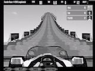

# coaster_racer_bot

## Overview:
This is an attempt at Sirajology's openai Universe [coding challenge](https://www.youtube.com/watch?v=mGYU5t8MO7s&t=11s).
It is a Q-Deep Learning model that learns the flash game CoasterRacer based on only the pixels of the screen and the score as read by Universe. It should (theoreticaly) work for any implementation of a flash game within Universe provided the dimensions of the opencv crop are correct, the game only requires left and right inputs, and the depth of the model sufficent to capture the game.

## Update:
I won! Somehow, this was the best bot sent in and I won the challenge. Thanks very much to Siraj for the challenge, I learnt heaps doing this. The announcement video can be seen [here](https://www.youtube.com/watch?v=0xVqLJe9_CY&t=205s) and the winning commit [here](https://github.com/av80r/coaster_racer_coding_challenge/commit/f8064d954f148f5344dce1a2dda0cc6c43dc5757).

## What the Bot sees:
In order to reduce the size of the learning task, the raw pixels, as recieved from Universe, are downsampled and convereted into black and white.
These are examples of what the bot sees:

## Controls:
In order to simplify the game, foward and nitro buttons are always pressed, thus the model is only left to learn the complexities of turning (left and right arrow keys).

## A Video of it in action
Keep in mind that epsilon is still .67 at this point: [YouTube](https://youtu.be/k1iWUnPV_og) (An epsilon value of .67 means that 67% of the time, it is still making random movements.)

## Dependancies

* tensorflow
* cv2
* numpy
* random
* collections
* gym
* universe

## Usage:

Either run train.py to train the model or demo.py to see it in action. demo.py loads the tensors from the TF checkpoint files and runs the model. (Check the file name that this tries to resore from if you haven't left this to train completely using my code or have made any alterations.)
Note that train.py doesn't render anything and as such, needs to be VNCd into to see whats happening.

## Credits
This code is heavily based on ||Source||'s here on github who "merely wrapped, updated and documented it" from [malreddysid](https://github.com/malreddysid).